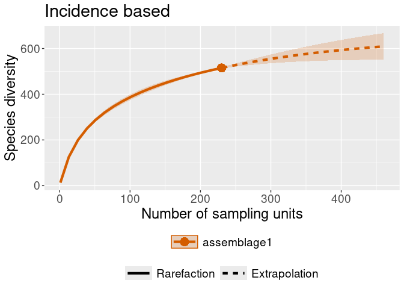

<!-- README.md is generated from README.Rmd. Please edit that file -->

# vlindersRarefaction

<!-- badges: start -->

[](https://lifecycle.r-lib.org/articles/stages.html#experimental)
[](https://github.com/PietrH/vlindersRarefaction/actions/workflows/R-CMD-check.yaml)
[](https://github.com/PietrH/vlindersRarefaction/actions/workflows/test-coverage.yaml)
[](https://app.codecov.io/gh/PietrH/vlindersRarefaction?branch=main)

<!-- badges: end -->

## Installation

You can install the development version of vlindersRarefaction from
[GitHub](https://github.com/) with:

``` r
# install.packages("devtools")
devtools::install_github("PietrH/vlindersRarefaction")
```

## Scope

This simple and experimental package converts a dataframe with a known
format to the format the [iNEXT
package](https://github.com/AnneChao/iNEXT) expects for abundance and
incidence frequency data.

The package was written with exactly this file in mind as a draft, with
little flexibility. This means that your file will need the following
columns as a minimum:

- date
- species_name
- year
- number

Any number of extra columns can be provided to split the rarefaction on,
these are called *assemblages* in the context of iNEXT.

    #> Rows: 2,976
    #> Columns: 5
    #> $ date         <date> 2009-06-19, 2009-07-01, 2009-08-13, 2009-08-30, 2010-06-…
    #> $ species_name <chr> "Bruine huismot", "Oranje iepentakvlinder", "Oranje worte…
    #> $ year         <dbl> 2009, 2009, 2009, 2009, 2010, 2010, 2010, 2010, 2010, 201…
    #> $ number       <dbl> 1, 1, 1, 1, 1, 1, 1, 1, 1, 1, 1, 1, 1, 1, 1, 1, 1, 1, 1, …
    #> $ MicroMacro   <chr> "Micro", "Macro", "Macro", "Macro", "Macro", "Macro", "Ma…

This is a basic example on how you can plug this package into iNEXT:

``` r
library(vlindersRarefaction)

## convert to formats iNEXT is expecting, then calculate rarefaction curves
rare_out_inc <-
  iNEXT::iNEXT(convert_to_incidence_freq(warande),
               datatype = "incidence_freq",
               nboot = 2 # for speed
               )
rare_out_abun <-
  iNEXT::iNEXT(convert_to_abundance(warande),
               datatype = "abundance",
               nboot = 2 # for speed
               )
## and plot them:
iNEXT::ggiNEXT(rare_out_abun) + ggplot2::ggtitle("Abundance based")
#> Warning in ggiNEXT.iNEXT(rare_out_abun): invalid color.var setting, the iNEXT
#> object do not consist multiple assemblages, change setting as Order.q
```


``` r
iNEXT::ggiNEXT(rare_out_inc) + ggplot2::ggtitle("Incidence based")
#> Warning in ggiNEXT.iNEXT(rare_out_inc): invalid color.var setting, the iNEXT
#> object do not consist multiple assemblages, change setting as Order.q
```

 Now with an
assemblage set:

``` r

# Let's generate some random area's for the observations to belong to.
warande_gebieden <- warande %>% 
  dplyr::mutate(gebied =
                  sample(
                    c("gebied_a", "gebied_b"),
                    nrow(warande),
                    replace = TRUE)
  )

rare_out_inc_gebied <-
  iNEXT::iNEXT(convert_to_incidence_freq(warande_gebieden, gebied),
               datatype = "incidence_freq",
               nboot = 2 # for speed
               )

rare_out_abun_micromacro <- 
    iNEXT::iNEXT(convert_to_abundance(warande, MicroMacro),
               datatype = "abundance",
               nboot = 2 # for speed
               )

## and plot them:
iNEXT::ggiNEXT(rare_out_inc_gebied) + ggplot2::ggtitle("Incidence based, with areas")
```


``` r
iNEXT::ggiNEXT(rare_out_abun_micromacro) + ggplot2::ggtitle("Abundance based, split on Micro/Macro")
```


